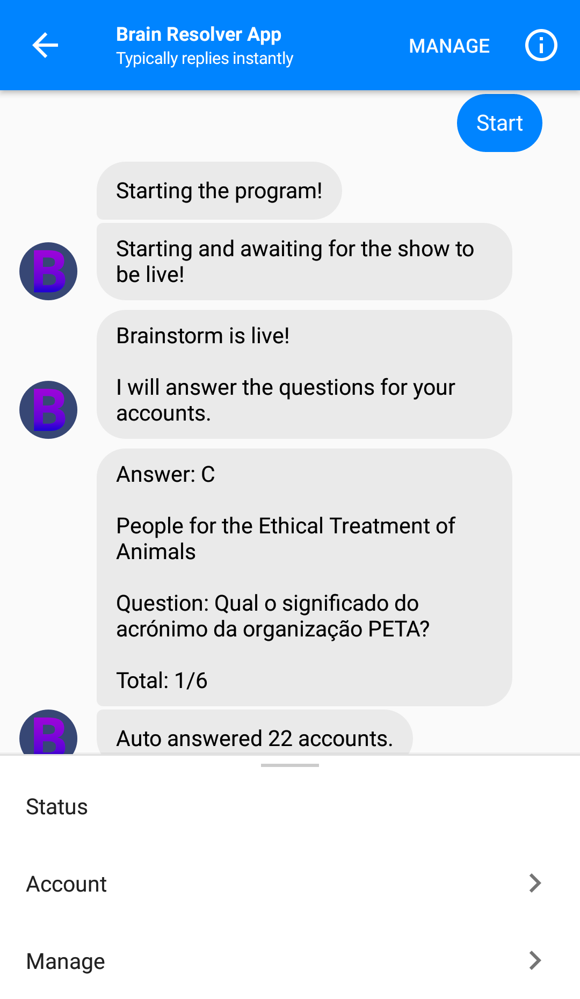

### Brainstorm Resolver

RTP show Brainstorm Resolver. This app gets the questions and the right answers when the show is live. It also answers automatically for the registered accounts.

### Modes
- `CLI`: The app can run as a console application.
- `Messenger Bot`: This app can also respond to messenger bot webhooks. [Messenger Platform](https://developers.facebook.com/docs/messenger-platform/getting-started/quick-start)

### Screens

Start                      |  On Finish
:-------------------------:|:-------------------------:
 |  

### Requirements
- `node` (using v8)
- `yarn` (faster than npm)

### Deploy
- `sudo yarn deploy` 
- `sudo yarn deploy-setup` 

### Instructions to develop
- `yarn install` - installs the dependencies
- `yarn start` - watch's `.ts` files and compiles to `build` folder then the server is reloaded at `localhost:3002`
- `yarn test` - runs the tests
- `yarn build` - compiles `.ts` files to `build` folder
- `yarn serve` - starts the api (`node build/server.js`)
- `yarn prettier` - runs prettier to prettify the code (also runs before each commit)

### Credentials

I obtained the server credentials by decompiling their android mobile app. They used Xamarin and with JetBrains dotPeek, it was easy to see the C# source code.

### License
MIT
